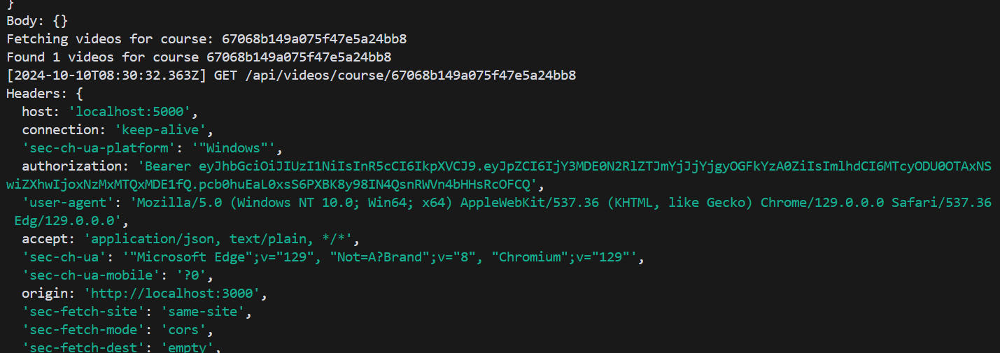
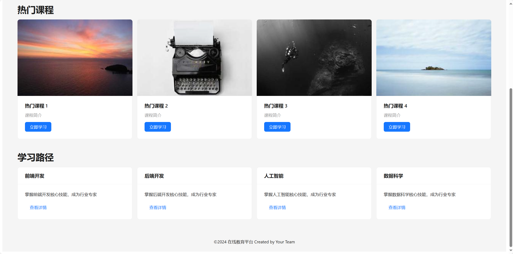
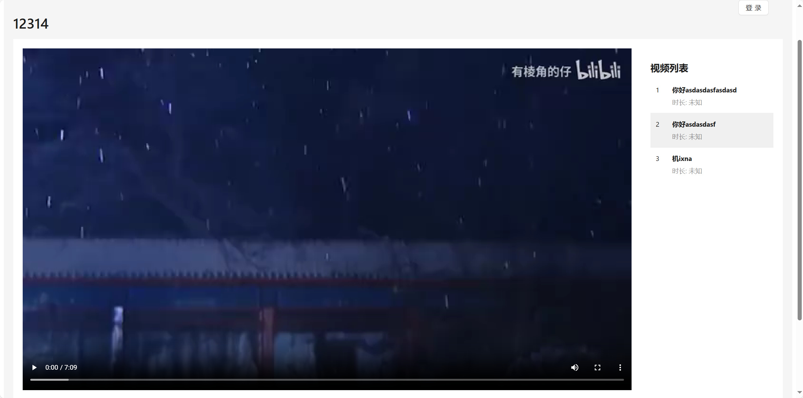
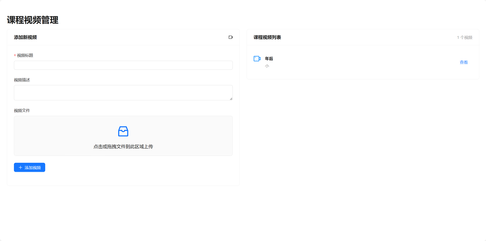
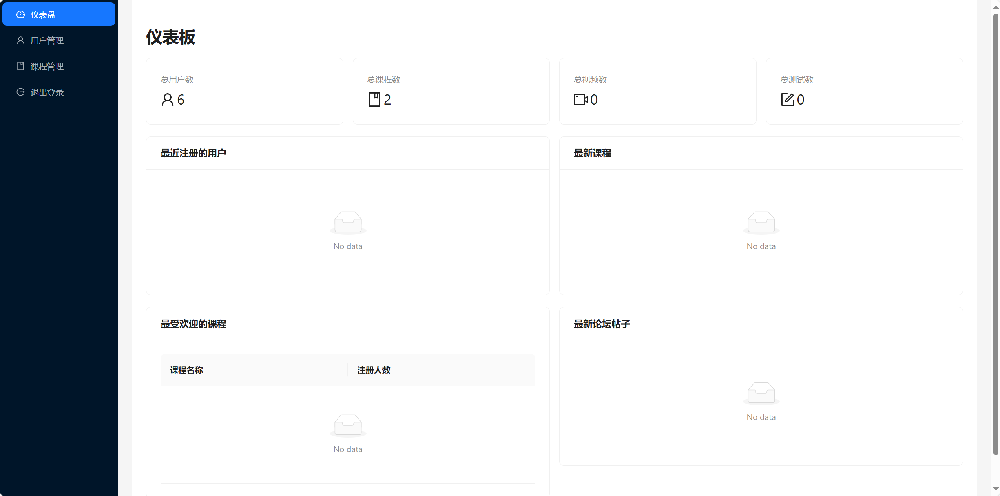

# 在线教育平台

# 在线教育平台

这是一个综合的在线教育平台，旨在提供高质量的在线学习体验。该平台包含后端 API 服务器、管理员前端界面和用户前端界面。

## 项目结构

- `backend/`: 后端 API 服务器
- `frontend-admin/`: 管理员前端界面
- `frontend-user/`: 用户前端界面

## 技术栈

- 后端：Node.js, Express.js, MongoDB
- 前端：React.js
- 文件存储：MinIO

## 功能特性

- 用户认证和授权
- 课程管理
- 视频流媒体
- 在线测试和评估
- 学习进度跟踪
- 管理员仪表板

## 项目截图

### 后端


### 客户端



### 管理员端



## 开发环境设置

1. 克隆仓库：
   ```
   git clone https://github.com/1361683218/onlineedu.git
   cd onlineedu
   ```

2. 配置环境变量：
   在 `backend/` 目录中创建 `.env` 文件，并设置必要的环境变量。

3. 启动开发服务器：
   - 后端：`cd backend && npm run dev`
   - 管理员前端：`cd frontend-admin && npm start`
   - 用户前端：`cd frontend-user && npm start`

## 贡献指南

我们欢迎所有形式的贡献。如果您想为项目做出贡献，请遵循以下步骤：

1. Fork 本仓库
2. 创建您的特性分支 (`git checkout -b feature/AmazingFeature`)
3. 提交您的更改 (`git commit -m 'Add some AmazingFeature'`)
4. 推送到分支 (`git push origin feature/AmazingFeature`)
5. 开启一个 Pull Request

## 许可证

本项目采用 MIT 许可证 - 查看 [LICENSE](LICENSE) 文件了解详情

## 联系方式

项目维护者：[1361683218](mailto:1361683218@qq.com)

项目链接：https://github.com/1361683218/onlineedu

## 使用说明

- 访问 http://localhost:3000 进入管理员界面
- 访问 http://localhost:3001 进入用户界面
- API 文档可在 http://localhost:5000/api-docs 查看（如果已配置 Swagger）


